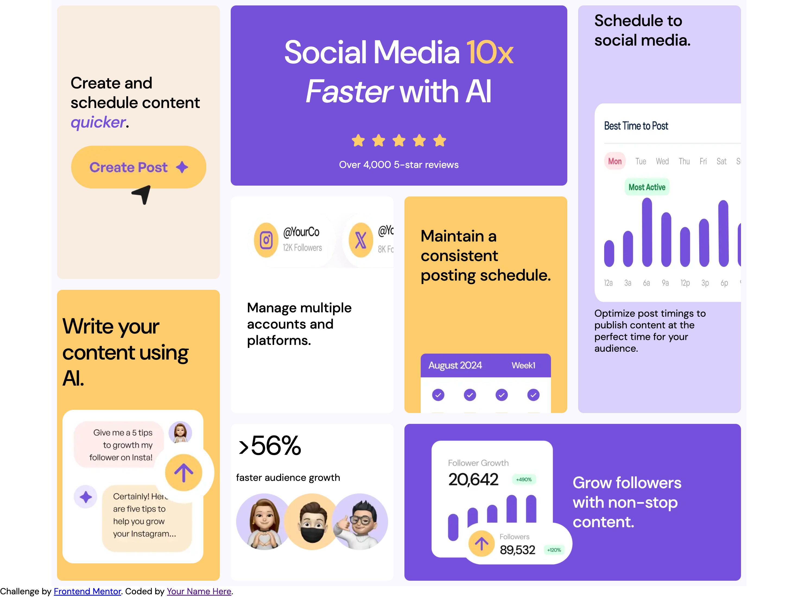

# Frontend Mentor - Solution Grille Bento

Il s'agit d'une solution pour le [défi Grille Bento sur Frontend Mentor](https://www.frontendmentor.io/challenges/bento-grid-RMydElrlOj). Les défis de Frontend Mentor vous aident à améliorer vos compétences en codage en construisant des projets réalistes.

## Table des matières

- [Frontend Mentor - Solution Grille Bento](#frontend-mentor---solution-grille-bento)
  - [Table des matières](#table-des-matières)
  - [Aperçu](#aperçu)
    - [Le défi](#le-défi)
    - [Capture d'écran](#capture-décran)
    - [Liens](#liens)
  - [Mon processus](#mon-processus)
    - [Technologies utilisées](#technologies-utilisées)
    - [Ce que j'ai appris](#ce-que-jai-appris)
    - [Développement continu](#développement-continu)
    - [Ressources utiles](#ressources-utiles)
  - [Auteur](#auteur)
  - [Remerciements](#remerciements)

**Remarque : Supprimez cette note et mettez à jour la table des matières en fonction des sections que vous conservez.**

## Aperçu

### Le défi

Les utilisateurs doivent être capables de :

- Voir la mise en page optimale de l'interface en fonction de la taille de l'écran de leur appareil.

### Capture d'écran



## Mon processus

### Technologies utilisées

- Marquage HTML5 sémantique
- Propriétés CSS personnalisées
- Flexbox
- CSS Grid
- Workflow mobile-first 

**Remarque : Ce sont juste des exemples. Supprimez cette note et remplacez la liste ci-dessus par vos propres choix.**

### Ce que j'ai appris

Utilisez cette section pour résumer certains de vos principaux apprentissages lors de la réalisation de ce projet. Les écrire et fournir des exemples de code des zones que vous souhaitez mettre en avant est un excellent moyen de renforcer vos propres connaissances.

Voici un exemple de la manière dont vous pouvez ajouter des extraits de code :

```html
<section class="conteneur__sectionGauche">
<!--7-->
<div class="conteneur__li createSchedule">
  <h2>Create and schedule content <span class="createSchedule__span"><i>quicker</i></span>.</h2>
  
</div>
<!--8-->
<div class="conteneur__li aiContent">
  <h2>Write your content using AI.</h2>
  
</div>
</section>
```

```css
@media(min-width: 600px){
    .conteneur {
            display: grid;
            grid-template-columns: repeat(4, 1fr);
            /* grid-template-rows: repeat(3, 1fr); */
            grid-column-gap: 0px;
            grid-row-gap: 0px;

            grid-template-areas: 
            "sectionGauche fiveStars fiveStars scheduleSocialMedia"
            "sectionGauche multipleAccounts scheduleContent scheduleSocialMedia"
            "sectionGauche fasterAudience growFollowers growFollowers"
        
    }
}
```

Si vous voulez plus d'aide pour rédiger du markdown, nous vous recommandons de consulter [Le Guide du Markdown](https://www.markdownguide.org/) pour en savoir plus.

**Remarque : Supprimez cette note et le contenu de cette section et remplacez-le par vos propres apprentissages.**

### Développement continu

Utilisez cette section pour préciser les domaines sur lesquels vous souhaitez continuer à vous concentrer lors de projets futurs. Il peut s'agir de concepts que vous ne maîtrisez pas encore totalement ou de techniques que vous avez trouvées utiles et que vous souhaitez affiner et perfectionner.

**Remarque : Supprimez cette note et le contenu de cette section et remplacez-le par vos propres projets de développement continu.**

### Ressources utiles

- [MDN](https://developer.mozilla.org/fr/) - Cela m'a aidé pour XYZ. J'ai vraiment aimé ce modèle et je vais l'utiliser à l'avenir.
- [W3S](https://www.w3schools.com/) - C'est un excellent article qui m'a aidé à comprendre XYZ. Je le recommanderais à toute personne qui apprend encore ce concept.

**Remarque : Supprimez cette note et remplacez la liste ci-dessus par des ressources qui vous ont aidé pendant le défi. Elles pourraient être utiles pour toute personne qui consulte votre solution ou pour vous-même lorsque vous reviendrez sur ce projet dans le futur.**

## Auteur

- Site Web - [Raphael Gosselin](https://www.your-site.com)
- Frontend Mentor - [@2134391@csfoy.ca](https://www.frontendmentor.io/profile/votrepseudo) 

**Remarque : Supprimez cette note et ajoutez/supprimez/modifiez les lignes ci-dessus en fonction des liens que vous souhaitez partager.**

## Remerciements

C'est ici que vous pouvez rendre hommage à toute personne qui vous a aidé sur ce projet. Peut-être avez-vous travaillé en équipe ou trouvé de l'inspiration dans la solution de quelqu'un d'autre. C'est l'endroit parfait pour leur rendre hommage.

**Remarque : Supprimez cette note et modifiez le contenu de cette section si nécessaire. Si vous avez réalisé ce défi seul, n'hésitez pas à supprimer cette section entièrement.**